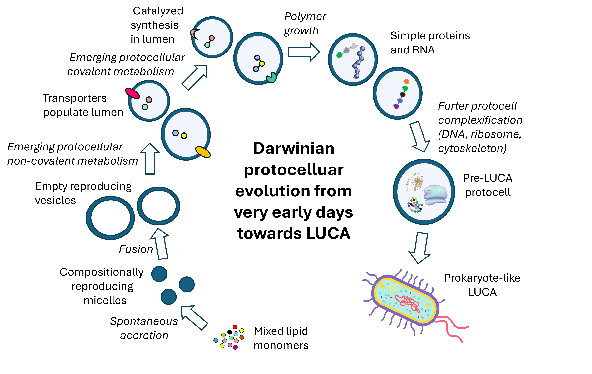

./(title: "")
# Welcome👋

Hi my name is Roy Yaniv, I work on origin of life research with Prof. Doron Lancet, focusing on lipid-first models and systems chemistry. My work includes conceptual development of theoretical frameworks for lipid-based protocells; investigating compositional inheritance and early Darwinian evolution; and exploring their implications for astrobiology and life-detection strategies.

------

I am also a science editor for the Davidson Institute, where I edit popular science articles you might have seen on the Davidson website or even sometimes on YNET.

----

### The origin of life to the Last Universal Common Ancestor via Darwinian evolution:

---

🐍 I am taking the Python programming course to further my skills and hopefully utilize the skills I learn in future work.

---

# ℹ️ More info:
[Lancet Lab website](https://www.weizmann.ac.il/molgen/Lancet/)

[CV](CV-Roy-Yaniv.pdf)

